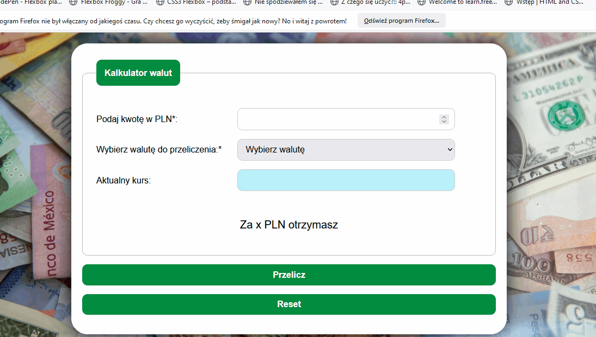

# currency-converter

Currency Exchange.  The website was made as a part of the course "Frontend Developer from Basics - youcode".
A simple currency calculator where I practiced creating forms and using functions in JavaScript. The application calculates the amount of money we get in a given currency after the exchange with PLN. 

## Demo

https://grzegorzdidyk.github.io/currency-converter/

### How to use:

1. Enter amount in PLN
2. Select the currency for conversion
3. Click the *"Przelicz"* button to convert the amount.
4. To reset the form click *"Reset"* button

### Technologies:

 - HTML
 - CSS
 - BEM
 - JavaScript  
